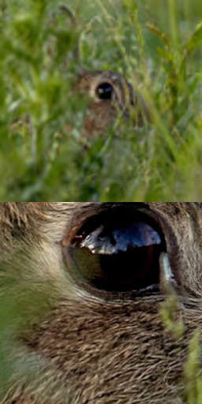
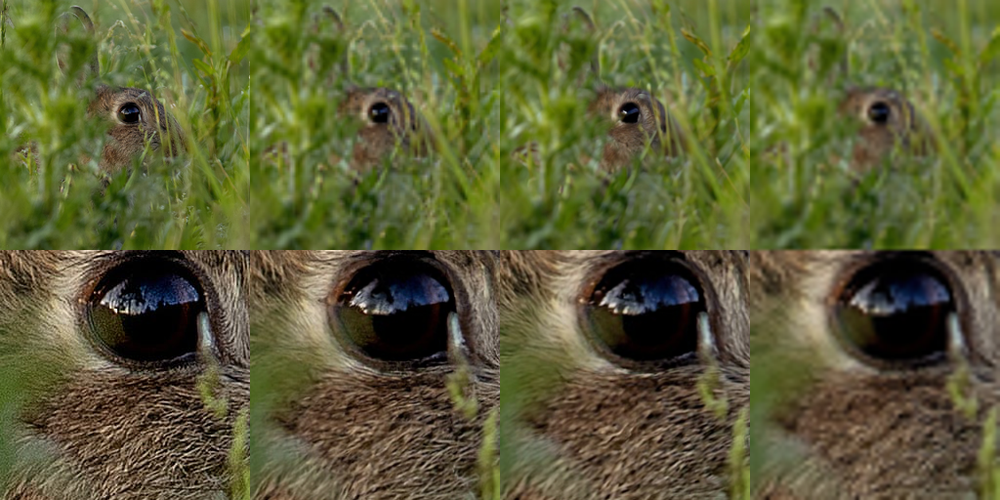
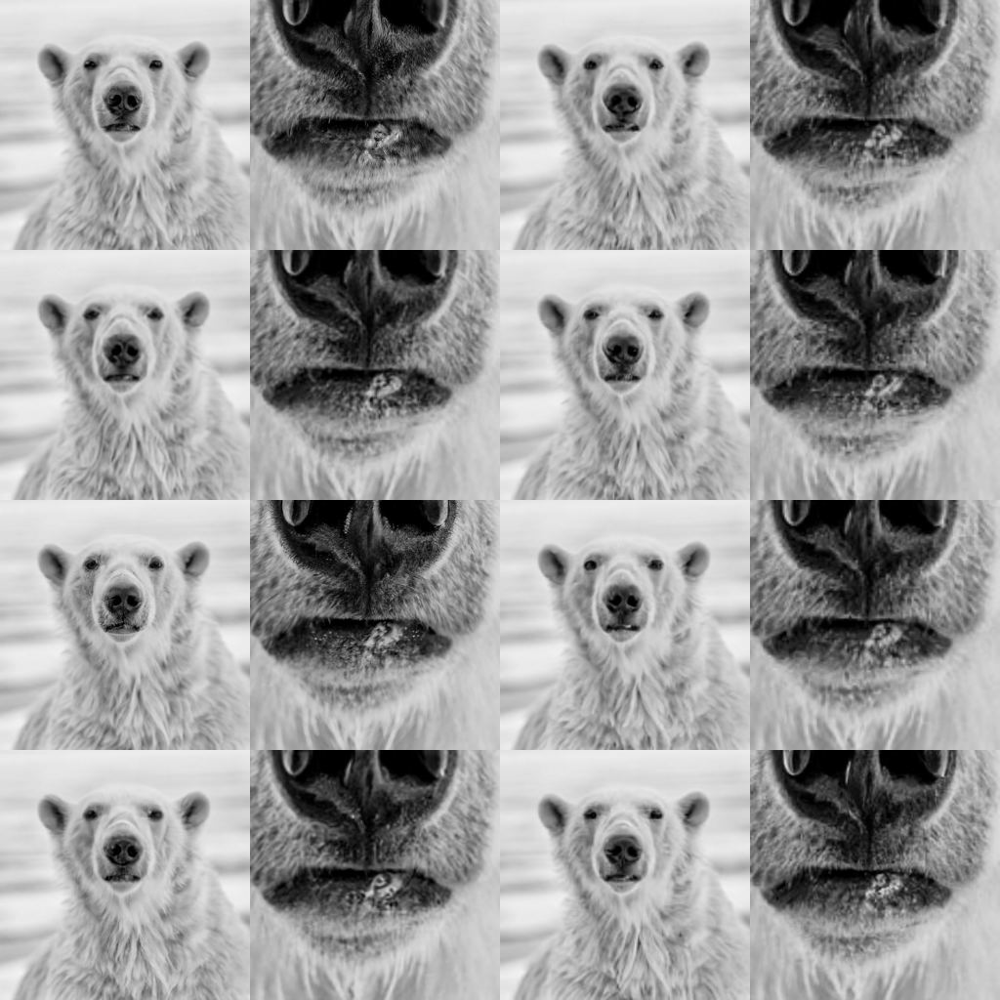

# Guided Diffusion Observations

Scripts from README.md have been translated to bash files inside `scripts/`

# Upsampling
`scripts/up_sample_64_256.sh`

Trained upscaling model is conditional. Running it with an .npz without classes fails lo load on account of missing parameter in model `'label_emb.weight'`. Loading data without class conditional fails to upscale.

To run upsampling either:
* generate 64x64 samples with `scripts/classifier_sample_64x64.sh` then use the generated .npz.
* or create an .npz with 2 arrays `.arr_0` with (b,3,64,64) uint8 data and `.arr_1` (b,) int classes; rough script to generate npz from .jpg or .png files in `scripts/utils.py`

## Observations
Even though generated data fails to capture larger scale structure information, textural quality of upsampling is higher when run over generated data than data from the wild; this is true even when `classes` match ImageNet classes.  `Does this mean that the learned model is biased towards ImageNet surface details?` 

Upsampling conditions by concatenating a bilinear upsampling model output, at every timestep before feeding back into model. `unet.SuperResModel().forward(x,t,low_res)`

### Upsample images in the wild

    <table><tr>
        <td>  <figcaption>From The Wild 256x256 patches</figcaption></td>
        <td> <figcaption>Downscaled 64x64</figcaption></td>
        <td> <figcaption>Up sampled to 256x256</figcaption></td>
    </tr></table>

### Upsample Generated Data

    <table><tr>
        <td> <figcaption>Generated 64x64</figcaption></td>
        <td> <figcaption>Up sampled to 256x256</figcaption></td>
    </tr></table>

<!-- [12, 863, 862, 201, 337, 788, 287, 857, 98, 50, 138, 445, 545, 330, 469, 534] -->
<!-- ['house_finch', 'totem_pole', 'torch', 'silky_terrier', 'beaver', 'shoe_shop', 'lynx', 'throne', 'red-breasted_merganser', 'American_alligator', 'bustard', 'bikini', 'electric_fan', 'wood_rabbit', 'caldron', 'dishwasher'] -->

### Upsampling Test: 250 / 1000 steps

    <table><tr>
        <td> <figcaption>Original</figcaption></td>
        <td> <figcaption>Up sampled (1000 steps)</figcaption></td>
        <td> <figcaption>Up sampled (250 steps)</figcaption></td>
        <td> <figcaption>Bicubic upsample</figcaption></td>
    </tr></table>

### Upsampling Test

    <table><tr>
        <td> <figcaption>Original</figcaption></td>
        <td> <figcaption>Up sampled</figcaption></td>
        <td> <figcaption>Bilinear upsample (input to model at every time step)</figcaption></td>
    </tr></table>

### Upsample image conditioned on different classes
`Class conditioning does not seem to make any subtantive difference in upsampling`.
Same image is upsaple with class conditionals

[296,296,466,466,469,469, 483,483,518,518,3,3,29,29,772,772] 

['ice_bear', 'ice_bear', 'bullet_train', 'bullet_train', 'caldron', 'caldron', 'castle', 'castle', 'crash_helmet', 'crash_helmet', 'tiger_shark', 'tiger_shark', 'axolotl', 'axolotl', 'safety_pin', 'safety_pin']

    <table><tr>
        <td>  <figcaption>From The Wild 256x256 patches</figcaption></td>
        <!-- <td>  <figcaption>From The Wild 256x256 patches</figcaption></td> -->
    </tr></table>

